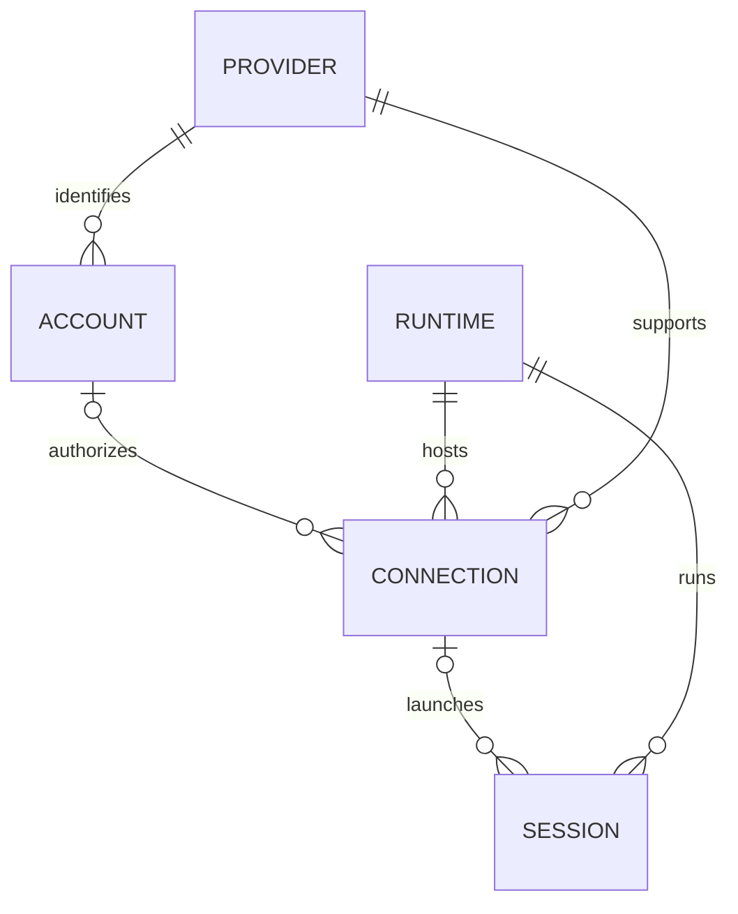

# Accounts, connections, runtimes and sessions

## What Conch had

`SessionInfo` (`src/sessions.ts`) is a flat process/session registry. `backend`
selects the Claude or Codex adapter. `sessionId` is a local routing key and
`agentSessionId` is the underlying conversation ID. The account-profile work
adds `claudeAccountId` / `codexAccountId`, `claudeConfigDir` and `accountLabel`. Parent references
express subagents and process ancestry, not provider or account nesting.

The containing `PublishedState.ownerDeviceId` identifies the daemon installation
that owns those routing keys. `RemoteMacStore` already keeps other devices'
snapshots separate and addresses a remote session by `(ownerDeviceId, localSessionKey)`.
Durable history uses `(ownerDeviceId, provider, nativeId)`, from `records-types.ts`
and `records-routing.ts`. These identities are unchanged by this addition.

## Added model

| Entity | Meaning | Example |
| --- | --- | --- |
| Provider | The agent backend | Claude, Codex |
| Account | A registered identity with a provider | Personal, Work |
| Runtime | Where execution happens | Laptop, desktop, provider cloud workspace |
| Connection | An account/provider configured on a runtime | Work Claude profile on laptop |
| Session | A conversation/process placed on that runtime | Fix checkout bug |

`src/execution-model.ts` defines these entities. Published snapshots contain an
`execution` catalog; each session row has a `SessionExecution` with `providerId`,
`runtimeId` and an optional `connectionId`. Account management replies include
the full local launch-profile catalog. Snapshots include the connections used
by their visible sessions. Configuration paths and credentials are not in the catalog.

Runtime kinds are **device** and **provider-cloud**. A device's local/remote
relationship is computed by the viewer, not stored on the runtime. A cloud
runtime has a provider and workspace identity; it has no local device owner.

One account can connect on several runtimes. Sessions remain flat records with
references, so the UI can group by provider, account, runtime or project without
moving sessions between data trees. Provider grouping is a presentation choice.

### Identity limits

Existing profiles are labelled `identity: local-registration`. They are not
verified provider subjects: `default` on one Mac does not identify the same
account as `default` on another. The generated catalog IDs include the owner
device, provider and profile ID. Matching emails do not merge identities.

The schema also allows `provider-subject` accounts with a verified subject.
An explicit binding/migration is needed before sharing such an account across
devices. This implementation does not assert that a profile keeps the same
underlying login forever; it identifies the configured launch registration.

Codex sessions without a known account get a provider and runtime reference
without an invented account. Existing device/terminal routing remains the
authority for commands. Settings → Environments opens the official `codex cloud`
terminal browser with the chosen account. Cloud workspace inventories and task
execution remain owned by Codex; Conch does not fabricate cloud runtime IDs or
provide a cross-device launch scheduler. Other Macs use the existing paired
connection for session viewing and typed input.

The durable record key intentionally stays device/provider/native ID. Moving a
conversation between account roots or machines needs a separate migration and
alias policy. Do not copy conversation UUIDs between roots as a migration.

## Provider settings and usage

The Mac Settings scene uses a persistent sidebar, with Providers, Environments, General, Phone app, Permissions, and Setup. T3 Code informed the provider grouping, isolated connection directories, visible identity, and progressive disclosure. Account creation is inline; continuing opens the selected provider’s official login and polls public auth status.
OpenAI/Codex accounts use isolated `CODEX_HOME` folders. Account identity, the
reported ChatGPT plan, and usage are read through Codex app-server’s public
`account/read` and `account/rateLimits/read` methods. No tokens or credential
files cross that interface into Conch. See [the Codex account guide](codex-accounts.md).

The upstream claude-swap dashboard is MIT licensed and built with Python/Textual. Conch's SwiftUI view ports its thin usage bars, severity thresholds, and reset countdowns into Conch's dark palette. Provider logos and emails remain visible; paths and maintenance actions expand on demand. See [the pinned attribution](../third-party/claude-swap/README.md).

The default collector is now Claude Code's supported status-line input (2.1.251+), not an external account manager. Login/launch installs an idempotent wrapper that preserves the original command and forwards its exact input/output. It records only five-hour and weekly percentages and reset times. Public CLI auth status binds readings to the profile's email and organization; changed identities cannot inherit a cached reading. Conch-initiated login clears the previous measurement. No credential files or Keychain entries are read by Conch.

The wrapper checks public identity on changed readings or once per minute. Settings refresh reads the cache, not a billing API. Missing windows remain unknown; passed reset windows disappear until a new Claude reading arrives. Readings older than five minutes are labelled Cached. Usage does not route sessions or rotate accounts.

The optional schema-v1 claude-swap adapter remains available in source with its own tests, but is not invoked by this settings flow. External collector slots are not automatically joined to launch profiles.

## Terminal and background launches

The Mac and iPhone New/Resume sheets send `host: terminal | background`.
Terminal remains the initial default; each app remembers the person's choice.
Both run on the selected Mac and retain the provider, account, working folder,
permission options and native resume ID. Teleport and Help still use Terminal.
`features.sessionHosts` prevents a new client offering Background against an
older daemon that would silently ignore the field.

Background uses a detached, Conch-named tmux session on the normal local tmux
server. This is a local CLI with a persistent PTY, not provider cloud hosting
or a Codex desktop task. Existing tmux delivery, approval, interrupt and screen
inspection paths work without raising a window or borrowing the clipboard.
Conch/app/daemon shutdown does not end the process. Mac sleep pauses local work;
logging out or rebooting can end the runtime, so resume the saved conversation.
“Open Terminal” attaches to that same running tmux session. Close sends the
provider's normal EOF sequence after verifying process identity. Restart
retains Background. An already-running conversation cannot be resumed a second
time into Background; close it first or explicitly fork it.

Codex uses the installed CLI's `--no-daemon` mode (verified in 0.159.2) so its
private app-server inherits the launcher's process marker. Only hooks whose
ancestry reaches that CLI and whose PID belongs to the exact Conch tmux pane
may register it; shared daemon and nested `codex exec` hooks stay excluded.
SessionStart supplies the conversation ID, including later in-TUI resumes.
Claude uses its normal interactive CLI and profile-scoped Conch hooks.
Background launches clear inherited provider API/token overrides, including
for the default profile, so an old tmux server cannot select a different
account. Authentication comes from the selected profile’s saved credentials.

Startup acknowledges a `backgroundId` before the provider has a conversation
ID. Both apps offer an “Open startup terminal” recovery action if login, hook
trust, or another first-run prompt prevents check-in. The daemon resolves this
opaque Conch name to its own tmux pane PID; callers never supply a PID. Conch
only answers Claude's folder-trust prompt when the user has already agreed.
