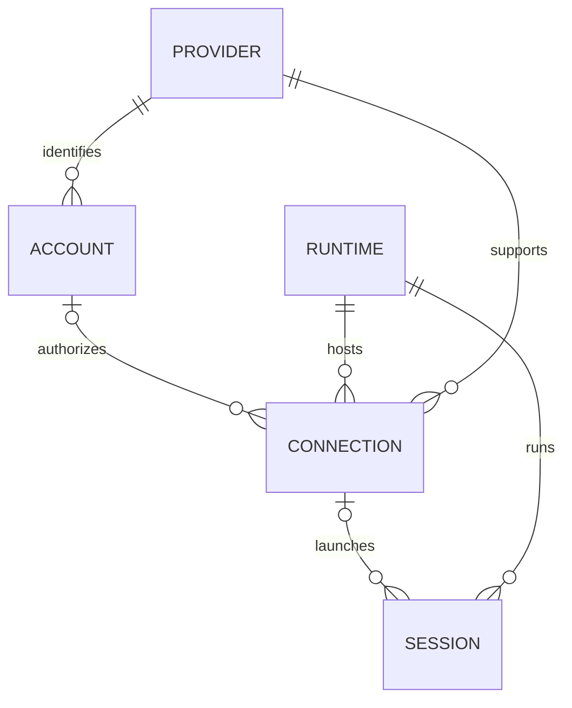

# Accounts, connections, runtimes and sessions

## What Conch had

`SessionInfo` (`src/sessions.ts`) is a flat process/session registry. `backend`
selects the Claude or Codex adapter. `sessionId` is a local routing key and
`agentSessionId` is the underlying conversation ID. The account-profile work
adds `claudeAccountId`, `claudeConfigDir` and `accountLabel`. Parent references
express subagents and process ancestry, not provider or account nesting.

The containing `PublishedState.ownerDeviceId` identifies the daemon installation
that owns those routing keys. `RemoteMacStore` already keeps other devices'
snapshots separate and addresses a remote session by `(ownerDeviceId, localSessionKey)`.
Durable history uses `(ownerDeviceId, provider, nativeId)`, from `records-types.ts`
and `records-routing.ts`. These identities are unchanged by this addition.

## Added model

| Entity | Meaning | Example |
| --- | --- | --- |
| Provider | The agent backend | Claude, Codex |
| Account | A registered identity with a provider | Personal, Work |
| Runtime | Where execution happens | Laptop, desktop, provider cloud workspace |
| Connection | An account/provider configured on a runtime | Work Claude profile on laptop |
| Session | A conversation/process placed on that runtime | Fix checkout bug |

`src/execution-model.ts` defines these entities. Published snapshots contain an
`execution` catalog; each session row has a `SessionExecution` with `providerId`,
`runtimeId` and an optional `connectionId`. Account management replies include
the full local launch-profile catalog. Snapshots include the connections used
by their visible sessions. Configuration paths and credentials are not in the catalog.

Runtime kinds are **device** and **provider-cloud**. A device's local/remote
relationship is computed by the viewer, not stored on the runtime. A cloud
runtime has a provider and workspace identity; it has no local device owner.

One account can connect on several runtimes. Sessions remain flat records with
references, so the UI can group by provider, account, runtime or project without
moving sessions between data trees. Provider grouping is a presentation choice.

### Identity limits

Existing profiles are labelled `identity: local-registration`. They are not
verified provider subjects: `default` on one Mac does not identify the same
account as `default` on another. The generated catalog IDs include the owner
device, provider and profile ID. Matching emails do not merge identities.

The schema also allows `provider-subject` accounts with a verified subject.
An explicit binding/migration is needed before sharing such an account across
devices. This implementation does not assert that a profile keeps the same
underlying login forever; it identifies the configured launch registration.

Codex sessions without a known account get a provider and runtime reference
without an invented account. Existing device/terminal routing remains the
authority for commands. Cloud execution is represented in the type model only;
no cloud connector or cross-device launch scheduler is supplied here.

The durable record key intentionally stays device/provider/native ID. Moving a
conversation between account roots or machines needs a separate migration and
alias policy. Do not copy conversation UUIDs between roots as a migration.

## Provider settings and usage

The Mac Settings scene uses a persistent sidebar, with Providers, General, Phone app, Permissions, and Setup. T3 Code informed the provider grouping, isolated connection directories, visible identity, and progressive disclosure. Account creation is inline; continuing opens the official Claude login and polls public auth status.

The upstream claude-swap dashboard is MIT licensed and built with Python/Textual. Conch's SwiftUI view ports its thin usage bars, severity thresholds, and reset countdowns into Conch's dark palette. Provider logos and emails remain visible; paths and maintenance actions expand on demand. See [the pinned attribution](../third-party/claude-swap/README.md).

The default collector is now Claude Code's supported status-line input (2.1.251+), not an external account manager. Login/launch installs an idempotent wrapper that preserves the original command and forwards its exact input/output. It records only five-hour and weekly percentages and reset times. Public CLI auth status binds readings to the profile's email and organization; changed identities cannot inherit a cached reading. Conch-initiated login clears the previous measurement. No credential files or Keychain entries are read by Conch.

The wrapper checks public identity on changed readings or once per minute. Settings refresh reads the cache, not a billing API. Missing windows remain unknown; passed reset windows disappear until a new Claude reading arrives. Readings older than five minutes are labelled Cached. Usage does not route sessions or rotate accounts.

The optional schema-v1 claude-swap adapter remains available in source with its own tests, but is not invoked by this settings flow. External collector slots are not automatically joined to launch profiles.
