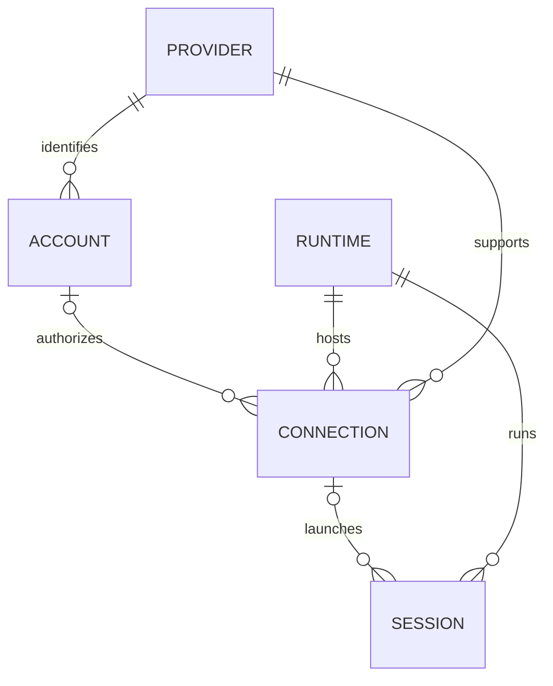

# Accounts, connections, runtimes and sessions

## What Conch had

`SessionInfo` (`src/sessions.ts`) is a flat process/session registry. `backend`
selects the Claude or Codex adapter. `sessionId` is a local routing key and
`agentSessionId` is the underlying conversation ID. The account-profile work
adds `claudeAccountId`, `claudeConfigDir` and `accountLabel`. Parent references
express subagents and process ancestry, not provider or account nesting.

The containing `PublishedState.ownerDeviceId` identifies the daemon installation
that owns those routing keys. `RemoteMacStore` already keeps other devices'
snapshots separate and addresses a remote session by `(ownerDeviceId, localSessionKey)`.
Durable history uses `(ownerDeviceId, provider, nativeId)`, from `records-types.ts`
and `records-routing.ts`. These identities are unchanged by this addition.

## Added model

| Entity | Meaning | Example |
| --- | --- | --- |
| Provider | The agent backend | Claude, Codex |
| Account | A registered identity with a provider | Personal, Work |
| Runtime | Where execution happens | Laptop, desktop, provider cloud workspace |
| Connection | An account/provider configured on a runtime | Work Claude profile on laptop |
| Session | A conversation/process placed on that runtime | Fix checkout bug |

`src/execution-model.ts` defines these entities. Published snapshots contain an
`execution` catalog; each session row has a `SessionExecution` with `providerId`,
`runtimeId` and an optional `connectionId`. Account management replies include
the full local launch-profile catalog. Snapshots include the connections used
by their visible sessions. Configuration paths and credentials are not in the catalog.

Runtime kinds are **device** and **provider-cloud**. A device's local/remote
relationship is computed by the viewer, not stored on the runtime. A cloud
runtime has a provider and workspace identity; it has no local device owner.

One account can connect on several runtimes. Sessions remain flat records with
references, so the UI can group by provider, account, runtime or project without
moving sessions between data trees. Provider grouping is a presentation choice.

### Identity limits

Existing profiles are labelled `identity: local-registration`. They are not
verified provider subjects: `default` on one Mac does not identify the same
account as `default` on another. The generated catalog IDs include the owner
device, provider and profile ID. Matching emails do not merge identities.

The schema also allows `provider-subject` accounts with a verified subject.
An explicit binding/migration is needed before sharing such an account across
devices. This implementation does not assert that a profile keeps the same
underlying login forever; it identifies the configured launch registration.

Codex sessions without a known account get a provider and runtime reference
without an invented account. Existing device/terminal routing remains the
authority for commands. Cloud execution is represented in the type model only;
no cloud connector or cross-device launch scheduler is supplied here.

The durable record key intentionally stays device/provider/native ID. Moving a
conversation between account roots or machines needs a separate migration and
alias policy. Do not copy conversation UUIDs between roots as a migration.

## claude-swap dashboard

The upstream project is MIT licensed. Its dashboard is Python/Textual; Conch is
SwiftUI. `ClaudeAccountsView.swift` ports its account cards, colours, severity
thresholds, quota bars, reset countdowns and freshness treatment. The copyright
and MIT notice ship in the app and source. See `third-party/claude-swap/README.md`
for the exact pinned revision and adapted files.

**Refresh usage** calls the optional installed `cswap list --json` through
`src/claude-swap.ts`, with a 12-second timeout, 1 MiB output limit, schema check
and whitelisted display fields. No credential or arbitrary error output is
returned to the app. Five-hour, weekly and per-model windows are supported;
spend/pacing/automatic rotation are not part of this port.

claude-swap owns its usage cache, backoff and OAuth refresh. Refreshing may
update its credential/cache state, as its normal list command does. Conch never
calls its switch/login/import commands. Collection runs only when requested,
not at startup or on a timer. The UI recomputes countdowns without API polling.

Unknown usage never becomes zero. Failed reads can show explicitly tagged
last-good usage; measurements older than five minutes are visibly cached.
Passing the reset time does not invent a renewed allowance. Missing collector,
empty account list and failed collection all have explicit states.

Usage accounts are shown separately from Conch's launch profiles. A collector
slot can be reused, and email can repeat across organizations. **Default login**
describes claude-swap's global login selection, not the account of every running
session. No automatic usage-to-profile association or quota-driven rotation
is performed.
